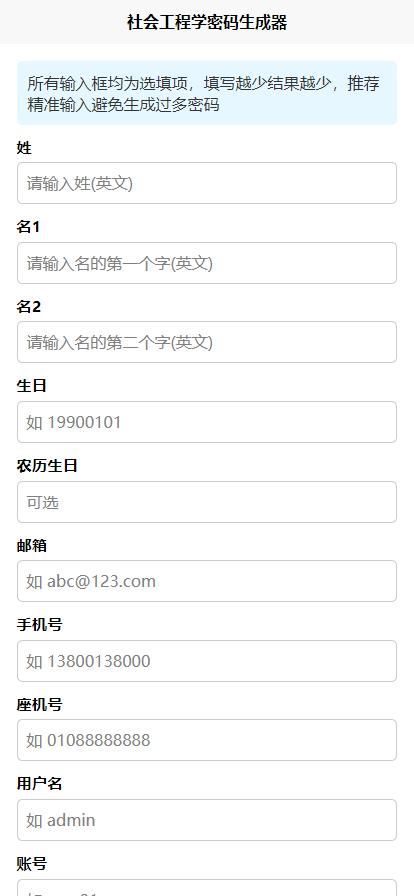
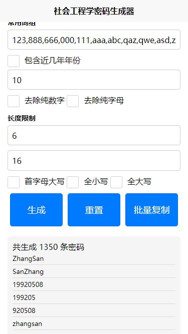

# 关于项目

## 🔍 介绍
本项目是一个社会工程学密码生成器，基于个人信息自动生成常见密码组合，适用于安全测试与近源渗透等场景。当前版本为原项目的二次开发版本，已适配 Uni-app，可在手机端灵活使用，便于移动环境下的密码字典生成。

## 🛠 技术架构
- **开发语言**：VUE3 + JavaScript
- **技术框架**：Uni-App
- **支持平台**：小程序、App、H5 等多端部署
- **适用场景**：在近源渗透过程中替代电脑，进行快速密码生成与测试

## 📱 使用演示

## 📚 原项目地址
本项目基于以下开源仓库进行改造，感谢原作者提供的代码支持，仅用于学习与参考：

👉 [原仓库地址](https://github.com/zgjx6/SocialEngineeringDictionaryGenerator)
